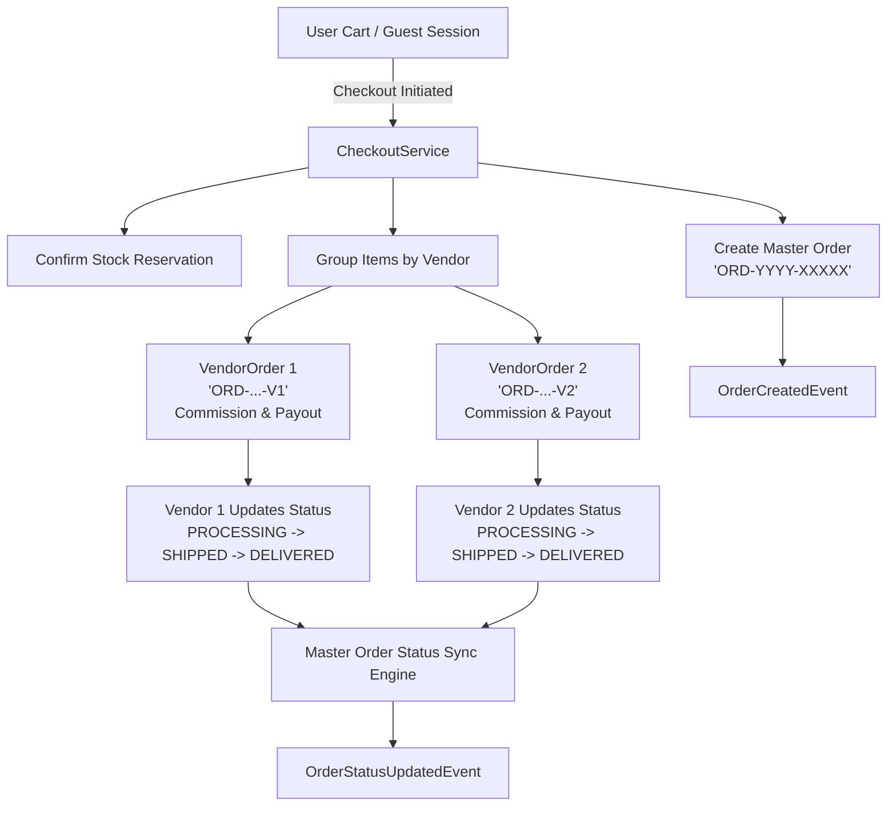

# Stage 12: Order Management System (OMS) & Multi-Vendor Sub-Orders

## 1. Overview & Architecture
Stage 12 upgrades the Alight International Marketplace with a production-grade Order Management System (OMS) featuring automatic multi-vendor sub-order splitting, vendor-level fulfillment workflows, split shipment tracking, automated commission/payout calculations, and master order state synchronization driven by Spring domain events.

---

## 2. Key Components & Implementation Details

### A. Flyway Schema Migration (`V38__order_management_and_suborders.sql`)
- Added commission and payout auditing columns:
  - `commission_rate NUMERIC(5, 2)`: Vendor commission rate snapshot.
  - `commission_amount NUMERIC(12, 2)`: Calculated platform commission.
  - `payout_amount NUMERIC(12, 2)`: Net payout to vendor (`grandTotal - commission`).
  - `notes TEXT`: Vendor/fulfillment notes.
- Performance Indexes:
  - `idx_orders_user_created` on `orders(user_id, created_at DESC)`
  - `idx_vendor_orders_vendor_status` on `vendor_orders(vendor_id, fulfillment_status)`
  - `idx_vendor_orders_master_order` on `vendor_orders(master_order_id)`
  - `idx_order_items_vendor_order` on `order_items(vendor_order_id)`
  - `idx_order_items_product_variant` on `order_items(product_id, variant_id)`

### B. Multi-Vendor Sub-Order Splitting & Commission Engine
- **Checkout Processing (`CheckoutServiceImpl.java`)**:
  - Automatically groups cart items by vendor.
  - Calculates line item subtotal, GST / tax rates (CGST/SGST vs IGST based on vendor state and shipping destination), and shipping allocation.
  - Computes vendor commission and net vendor payout amount.
  - Generates unique sub-order identifiers (`ORD-YYYY-XXXXX-V1`, `ORD-YYYY-XXXXX-V2`).
  - Publishes `OrderCreatedEvent`.

### C. Sub-Order Fulfillment Lifecycle & Master Order State Synchronization
- **Fulfillment Engine (`OrderServiceImpl.java`)**:
  - `updateVendorOrderFulfillment`: Vendors update their sub-order status with courier name, tracking number (AWB), and notes. Automatically captures `shippedAt` and `deliveredAt` timestamps.
  - **Auto-Progression Logic**:
    - If any vendor order moves to `PROCESSING`, master order moves to `PROCESSING`.
    - If all vendor orders are `SHIPPED` or `DELIVERED`, master order automatically transitions to `SHIPPED`.
    - When all vendor orders reach `DELIVERED`, master order transitions to `DELIVERED`.
    - Dispatches `OrderStatusUpdatedEvent` for audit trails, analytics, and customer notifications.

### D. Security & Data Isolation
- RBAC validation ensures buyers can only access their own orders.
- Vendors can only view and fulfill sub-orders belonging to their approved store.
- Administrators retain cross-tenant visibility and manual status override capabilities.

---

## 3. Verification & Test Suite
- Comprehensive end-to-end integration test suite implemented in [`OrderManagementIntegrationTest.java`](file:///c:/Users/kulde/OneDrive/Desktop/alight.com/backend/src/test/java/com/alight/marketplace/modules/order/OrderManagementIntegrationTest.java):
  1. `testMultiVendorOrderCheckoutAndSubOrderSplitting`: Multi-vendor checkout, sub-order splitting, commission and payout calculation, address linking.
  2. `testVendorOrderFulfillmentProgression`: Full sub-order fulfillment lifecycle (`PROCESSING` -> `SHIPPED` with AWB -> `DELIVERED`) and automatic master order status synchronization.
  3. `testOrderAccessControlAndFiltering`: Multi-tenant isolation between buyers, vendors, and administrators.
- Unit test suites updated: [`CheckoutServiceTest.java`](file:///c:/Users/kulde/OneDrive/Desktop/alight.com/backend/src/test/java/com/alight/marketplace/modules/order/service/CheckoutServiceTest.java) and [`OrderServiceTest.java`](file:///c:/Users/kulde/OneDrive/Desktop/alight.com/backend/src/test/java/com/alight/marketplace/modules/order/service/OrderServiceTest.java).
- Build compilation: **`BUILD SUCCESS`** across 56 test classes.
