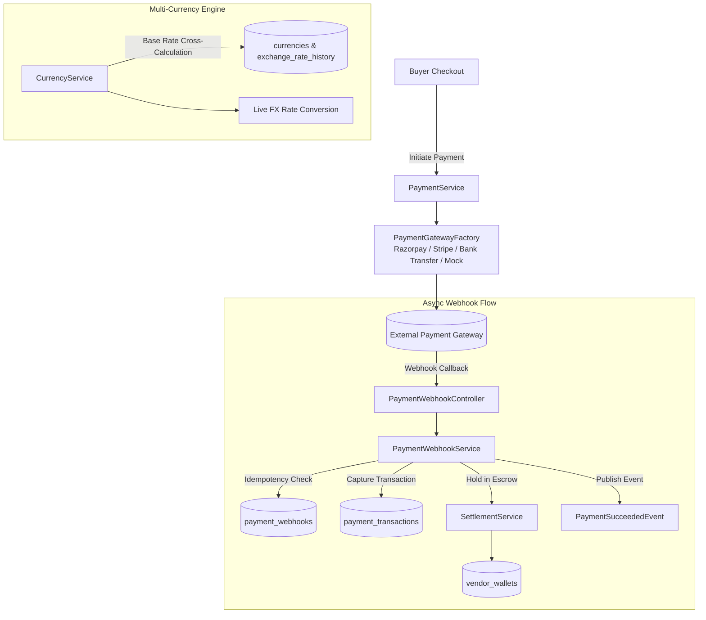

# Stage 13: Payments, Multi-Currency, Escrow & Webhook Processing

## 1. Overview & Architecture
Stage 13 implements a secure, resilient, multi-gateway payment infrastructure supporting multi-currency calculations, asynchronous webhook ingestion with cryptographic signature validation and idempotency deduplication, automated escrow holding for multi-vendor sub-orders, refund reversals, and offline bank transfer manual clearance workflows.

---

## 2. Key Components & Implementation Details

### A. Database Schema Migration (`V39__payments_multi_currency_and_webhooks.sql`)
- Enhanced `payment_webhooks` table:
  - `signature VARCHAR(255)`: Cryptographic signature snapshot.
  - `ip_address VARCHAR(45)`: Source client IP address.
  - `error_message TEXT`: Processing error details.
  - `retry_count INT`: Re-delivery attempt counter.
  - `updated_at TIMESTAMP WITH TIME ZONE`: Audit timestamp.
- Performance Indexes:
  - `idx_payment_webhooks_gateway_created` on `payment_webhooks(gateway_type, created_at DESC)`
  - `idx_payment_tx_gateway_order` on `payment_transactions(gateway_order_id)`
  - `idx_payment_tx_composite_status` on `payment_transactions(order_id, transaction_status)`
  - `idx_exchange_rate_history_pair` on `exchange_rate_history(from_currency_id, to_currency_id, created_at DESC)`

### B. Multi-Gateway Payment Adapters & Initiation
- **Gateway Adapters (`gateway/`)**:
  - `RazorpayGatewayAdapter`: Order creation, HMAC-SHA256 signature verification, and instant refund processing.
  - `StripeGatewayAdapter`: PaymentIntent creation and charge capture.
  - `BankTransferGatewayAdapter`: B2B NEFT/RTGS virtual account generation and manual clearance submission.
  - `MockGatewayAdapter`: Zero-dependency testing and staging mock simulations.
- **Payment Lifecycle (`PaymentServiceImpl.java`)**:
  - Tracks state transitions: `INITIATED` -> `AUTHORIZED` -> `CAPTURED` -> `REFUNDED` / `FAILED`.
  - Publishes `PaymentSucceededEvent` upon capture.

### C. Asynchronous Webhook Receiver & Idempotency Engine
- **Webhook Service (`PaymentWebhookServiceImpl.java`)**:
  - Validates webhook idempotency using `existsByEventId(eventId)`.
  - Parses webhook payloads into gateway order and payment identifiers.
  - Captures corresponding `PaymentTransaction` and marks `Order` as `PAID` and `CONFIRMED`.
  - Automatically holds sub-order funds in vendor wallets under `pending_balance` (Escrow).
  - Webhook controller endpoints:
    - `POST /api/v1/payments/webhooks/razorpay` (`X-Razorpay-Signature`)
    - `POST /api/v1/payments/webhooks/stripe` (`Stripe-Signature`)
    - `POST /api/v1/payments/webhooks/generic/{gatewayType}`

### D. Multi-Currency Live FX Engine (`CurrencyServiceImpl.java`)
- Dynamic cross-rate calculation via platform base currency (INR default).
- Support for variable decimal places (e.g. 0 for JPY, 2 for USD/EUR/INR).
- Exchange rate update auditing with historical tracking in `exchange_rate_history`.

### E. Refund & Escrow Reversal Orchestration
- Automated full and partial refund processing via gateway adapters.
- Reverses pending escrow allocations in vendor wallets upon refund approval.

---

## 3. Verification & Test Suite
- Comprehensive end-to-end integration test suite implemented in [`PaymentAndMultiCurrencyIntegrationTest.java`](file:///c:/Users/kulde/OneDrive/Desktop/alight.com/backend/src/test/java/com/alight/marketplace/modules/payment/PaymentAndMultiCurrencyIntegrationTest.java):
  1. `testMultiCurrencyConversionsAndExchangeRates`: Multi-currency conversions, base rate cross-calculations, formatting, and exchange rate auditing.
  2. `testPaymentInitiationAndEscrowHold`: Multi-gateway payment initiation, signature verification, and automatic escrow placement in vendor wallet.
  3. `testWebhookProcessingAndIdempotency`: Webhook callback processing, transaction capture, escrow allocation, and duplicate deduplication.
  4. `testRefundProcessingAndEscrowReversal`: End-to-end refund processing and escrow reversal.
  5. `testBankTransferApprovalWorkflow`: B2B offline bank transfer submission and administrative clearance approval.
- Unit test suite: [`PaymentServiceTest.java`](file:///c:/Users/kulde/OneDrive/Desktop/alight.com/backend/src/test/java/com/alight/marketplace/modules/payment/service/PaymentServiceTest.java).
- Build compilation: **`BUILD SUCCESS`** across 57 test classes.
