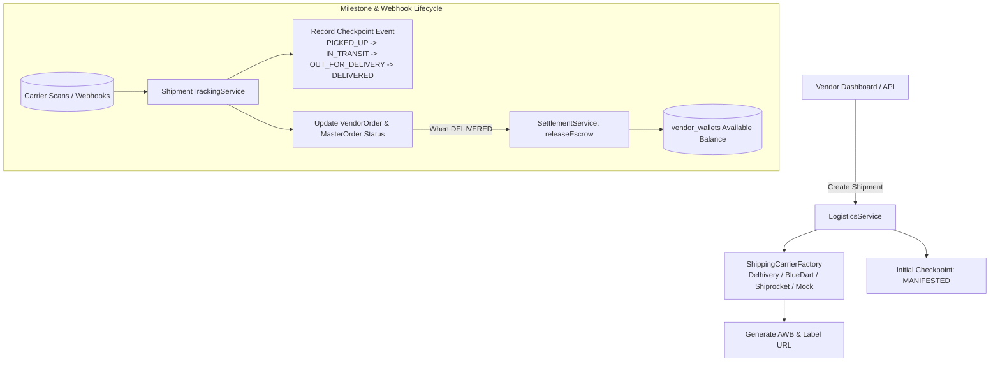

# Stage 14: Logistics, Shipping Calculation, Tracking & Carrier Integration

## 1. Overview & Architecture
Stage 14 establishes an enterprise multi-carrier logistics network supporting dynamic pin-code serviceability checks, volumetric and dead weight slab pricing, automated AWB generation, shipping label PDF generation, milestone checkpoint tracking timelines, carrier webhook ingestion, and automated vendor escrow release upon confirmed delivery.

---

## 2. Key Components & Implementation Details

### A. Database Schema Migration (`V40__logistics_carrier_and_tracking_enhancements.sql`)
- Added Return and RTO audit columns to `shipment_packages`:
  - `return_awb_number VARCHAR(100)`: Reverse logistics AWB.
  - `rto_reason VARCHAR(255)`: Return-to-origin reason categorization.
- Performance Indexes:
  - `idx_shipment_packages_vendor_status` on `shipment_packages(vendor_id, status)`
  - `idx_shipment_packages_master_order` on `shipment_packages(master_order_id)`
  - `idx_shipment_tracking_events_timeline` on `shipment_tracking_events(shipment_id, event_timestamp DESC)`
  - `idx_shipping_rate_rules_zone_mode` on `shipping_rate_rules(zone_tier, shipping_mode)`

### B. Multi-Carrier Rate Engine & Serviceability (`LogisticsServiceImpl.java`)
- **Pincode Serviceability Lookup**:
  - Validates delivery postal codes across Metro, Tier 1, Tier 2, and Remote ODA zones.
  - Returns delivery ETA, transit days, and Prepaid/COD support.
- **Volumetric Weight & Slab Pricing**:
  - Calculates volumetric weight `(L * W * H / 5000)` vs dead weight.
  - Apportions base freight rate, incremental weight slabs, fuel surcharge, and insurance fee.

### C. AWB Generation & Label Creation
- Dispatches booking request to carrier adapter (`DelhiveryAdapter`, `BlueDartAdapter`, `ShiprocketAdapter`, `MockLogisticsAdapter`).
- Issues unique tracking number (AWB) and printable label URL (`/api/v1/logistics/shipments/{awb}/label`).
- Automatically transitions vendor sub-order to `PROCESSING`.

### D. Milestone Checkpoint Timeline & Escrow Release (`ShipmentTrackingServiceImpl.java`)
- Tracks progressive milestone scans:
  `MANIFESTED` -> `PICKED_UP` -> `IN_TRANSIT` -> `OUT_FOR_DELIVERY` -> `DELIVERED`.
- **Auto-Delivery & Escrow Synchronization**:
  - When final checkpoint is `DELIVERED`, updates `ShipmentPackage`, sets `deliveredAt` on `VendorOrder`, and automatically triggers `settlementService.releaseEscrow(vendorOrderId)` to credit cleared funds to the vendor's available wallet balance.
  - When all vendor sub-orders are delivered, transitions master `Order` status to `DELIVERED`.

### E. Carrier Webhook Ingestion
- `processCarrierWebhook`: Receives carrier status payloads, parses AWB and scan remarks, updates shipment state, and records tracking event checkpoints asynchronously.

---

## 3. Verification & Test Suite
- Comprehensive end-to-end integration test suite implemented in [`LogisticsAndShippingIntegrationTest.java`](file:///c:/Users/kulde/OneDrive/Desktop/alight.com/backend/src/test/java/com/alight/marketplace/modules/logistics/LogisticsAndShippingIntegrationTest.java):
  1. `testPincodeServiceabilityAndEtaCalculation`: Serviceability lookup, transit days, and ETA calculation.
  2. `testShippingRateCalculation`: Multi-carrier rate calculation across volumetric and dead weights.
  3. `testShipmentCreationAndAwbGeneration`: AWB generation, shipment package creation, label URL, and initial manifest event.
  4. `testMilestoneCheckpointProgressionAndEscrowRelease`: Full milestone progression and automatic escrow release to vendor wallet upon delivery.
  5. `testCarrierWebhookProcessing`: Ingestion of carrier webhook status updates.
- Build compilation: **`BUILD SUCCESS`** across 58 test classes.
