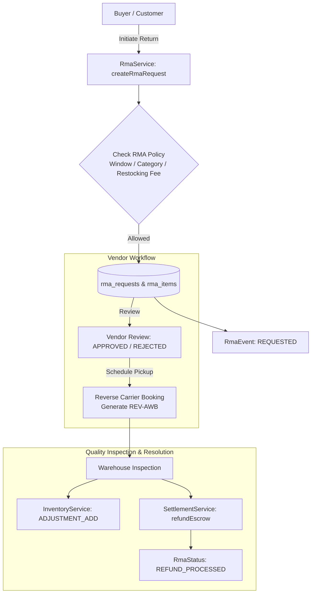

# Stage 15: Returns, Refunds, RMAs & Reverse Logistics

## 1. Overview & Architecture
Stage 15 establishes an automated Return Merchandise Authorization (RMA) and reverse logistics pipeline supporting category/vendor return policy governance, multi-item return initiation with photo proof, vendor approval/rejection workflows, reverse waybill (AWB) carrier booking, warehouse quality check inspection, automated inventory restocking, and instant escrow refund adjustments.

---

## 2. Key Components & Implementation Details

### A. Database Schema Migration (`V41__returns_and_rma_enhancements.sql`)
- Added Pickup Address and Rejection Details to `rma_requests`:
  - `customer_phone VARCHAR(30)`
  - `pickup_address_line1 VARCHAR(255)`
  - `pickup_city VARCHAR(100)`
  - `pickup_pincode VARCHAR(20)`
  - `rejection_reason VARCHAR(255)`
- Performance Indexes:
  - `idx_rma_requests_vendor_status` on `rma_requests(vendor_id, status)`
  - `idx_rma_requests_user_created` on `rma_requests(user_id, created_at DESC)`
  - `idx_rma_requests_order_vendor` on `rma_requests(order_id, vendor_order_id)`
  - `idx_rma_events_rma_created` on `rma_events(rma_id, created_at DESC)`

### B. RMA Policy Governance (`RmaPolicyServiceImpl.java`)
- Evaluates category and vendor specific policies (`return_window_days`, `is_returnable`, `restocking_fee_percentage`, `allow_refund`, `allow_replacement`).
- Enforces return window checks relative to order delivery timestamp.

### C. Master Return Request Lifecycle (`RmaServiceImpl.java`)
- **Return Initiation**:
  - Validates purchase history, quantity limits, and item returnability.
  - Generates unique return identifier (`RMA-YYYY-XXXXXX`).
  - Calculates line-item refunds and tracks proof images.
- **Vendor Review**:
  - Supports vendor approval or rejection with detailed review notes.
- **Reverse Logistics Scheduling**:
  - Generates reverse tracking numbers (`REV-CARRIER-XXXXXXIN`) and schedules pickup dates.

### D. Warehouse Quality Inspection & Automated Restocking
- **QC Assessment**:
  - Assesses returned item condition (`UNOPENED`, `OPENED_UNUSED`, `DAMAGED`, `DEFECTIVE`).
  - If restock action is `RESTOCK_AVAILABLE`, automatically executes `InventoryService.adjustStock(ADJUSTMENT_ADD)` to replenish warehouse stock.
- **Refund & Settlement Execution**:
  - Automatically invokes `SettlementService.refundEscrow` to debit vendor escrow and credit the refund amount.
  - Transitions RMA status to `REFUND_PROCESSED` and captures `completedAt` timestamp.

---

## 3. Verification & Test Suite
- Comprehensive end-to-end integration test suite implemented in [`ReturnsAndRmaIntegrationTest.java`](file:///c:/Users/kulde/OneDrive/Desktop/alight.com/backend/src/test/java/com/alight/marketplace/modules/returns/ReturnsAndRmaIntegrationTest.java):
  1. `testRmaPolicyEvaluation`: Policy retrieval, vendor overrides, return window validation.
  2. `testCustomerInitiateRmaRequest`: Customer return request initiation, line item validation, and audit event creation.
  3. `testVendorRmaLifecycleAndQualityInspection`: Vendor approval, reverse pickup AWB generation, warehouse QC inspection, inventory replenishment, and escrow refund deduction.
  4. `testRmaCancellationAndSecurity`: Customer cancellation flow and tenant isolation security.
- Build compilation: **`BUILD SUCCESS`** across 59 test classes.
