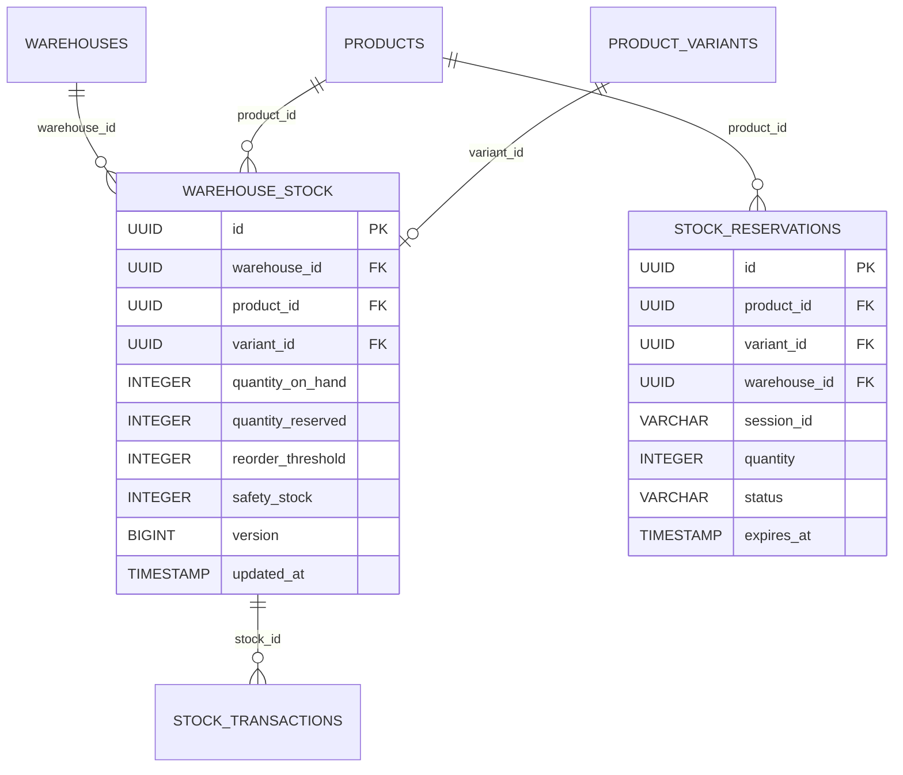
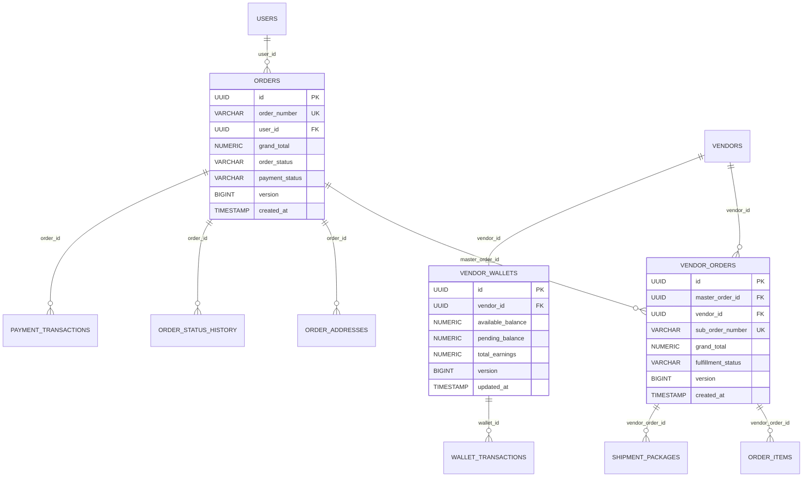

# Stage 2: Production-Grade Database & ERD Specification
**Alight International Multi-Vendor Marketplace**  
*Document Version:* 2.0.0 (Production-Ready)  
*Target Engine:* PostgreSQL 16+ / PostgreSQL 18  
*Migration Framework:* Flyway (`V1__initial_schema.sql` through `V30__production_erd_optimizations_and_triggers.sql`)  
*Total Tables:* 71 Base Tables + 6 System Views/Metadata  

---

## 1. Architectural Principles & Enterprise Standards

1. **Primary Key Standard**: All business tables use cryptographically secure 128-bit UUIDs (`gen_random_uuid()`) to prevent enumeration attacks, enable client-side UUID pre-generation, and support distributed multi-warehouse synchronization.
2. **Optimistic Locking**: Critical transactional entities (`warehouse_stock`, `vendor_wallets`, `orders`, `vendor_orders`, `products`, `carts`, `coupons`) feature a `version BIGINT DEFAULT 0` column checked via JPA `@Version` to eliminate race conditions during high-volume flash sales and concurrent checkouts.
3. **Automated Timestamp Triggers**: High-performance PL/pgSQL trigger (`trg_set_updated_at`) automatically updates `updated_at` on every row mutation, eliminating application-side timestamp drift.
4. **Trigram & Full-Text Search**: PostgreSQL extension `pg_trgm` powers GIN indexes across product titles, SKUs, brand names, and vendor store names for sub-10ms autocomplete, typo tolerance, and faceted catalog search.
5. **Multi-Vendor Partitioning**: Orders are architected with a Parent-Child pattern (`orders` -> `vendor_orders` -> `order_items`) enabling independent vendor shipping, partial fulfillment, vendor-isolated settlements, and RMA handling.

---

## 2. Global Entity Table Dictionary (71 Tables)

| Domain | Table Name | PK Type | Description | Concurrency |
| :--- | :--- | :--- | :--- | :--- |
| **System** | `system_metadata` | `VARCHAR(64)` | System-level health markers and migration flags | - |
| **User & Auth** | `users` | `UUID` | Customer, vendor, and administrator credentials | `updated_at` |
| **User & Auth** | `roles` | `UUID` | RBAC roles (CUSTOMER, VENDOR, ADMIN, SUPER_ADMIN) | Immutable |
| **User & Auth** | `permissions` | `UUID` | Fine-grained API and resource permissions | Immutable |
| **User & Auth** | `user_roles` | `(user_id, role_id)` | Cross-table mapping users to roles | - |
| **User & Auth** | `role_permissions` | `(role_id, perm_id)` | Cross-table mapping roles to permissions | - |
| **User & Auth** | `user_addresses` | `UUID` | Customer billing and shipping delivery addresses | `updated_at` |
| **User & Auth** | `user_sessions` | `UUID` | Active user sessions and device telemetry | - |
| **User & Auth** | `refresh_tokens` | `UUID` | JWT refresh tokens with rotation and revocation | - |
| **Vendor** | `vendors` | `UUID` | Multi-vendor business entity and verification state | `updated_at` |
| **Vendor** | `vendor_business_details` | `UUID` | Legal registration, GSTIN, PAN, and KYC details | `updated_at` |
| **Vendor** | `vendor_pickup_addresses` | `UUID` | Warehouse pickup locations for carrier dispatches | `updated_at` |
| **Vendor** | `vendor_documents` | `UUID` | KYC documents, GST certificates, and identity proofs | - |
| **Vendor** | `vendor_bank_accounts` | `UUID` | Verified bank accounts for automated payout disbursals | `updated_at` |
| **Catalog** | `categories` | `UUID` | Hierarchical N-level product category tree | `updated_at` |
| **Catalog** | `brands` | `UUID` | Official manufacturer and designer brands | `updated_at` |
| **Catalog** | `products` | `UUID` | Core product master record with pricing and SEO | `@Version` |
| **Catalog** | `product_variants` | `UUID` | Size, finish, color, and dimension variations | `updated_at` |
| **Catalog** | `product_images` | `UUID` | High-res gallery media, CDN URLs, and alt texts | - |
| **Catalog** | `product_attributes` | `UUID` | Key-value technical specifications (Material, Grade) | - |
| **Catalog** | `product_tags` | `UUID` | Search tags and promotional taxonomy | - |
| **Inventory** | `warehouses` | `UUID` | Regional fulfillment hubs and vendor warehouses | `updated_at` |
| **Inventory** | `warehouse_stock` | `UUID` | SKU stock on-hand, reserved, and safety thresholds | `@Version` |
| **Inventory** | `stock_reservations` | `UUID` | Temporary cart/checkout stock locks with TTL | - |
| **Inventory** | `stock_transactions` | `UUID` | Immutable ledger of stock movements (IN/OUT/ADJ) | Immutable |
| **Inventory** | `inventory_audit_logs` | `UUID` | Physical stock count reconciliation logs | Immutable |
| **Pricing & Tax** | `currencies` | `UUID` | Supported marketplace currencies (INR, USD, AED, EUR) | `updated_at` |
| **Pricing & Tax** | `currency_exchange_rates`| `UUID` | Real-time and manual FX conversion rates | `updated_at` |
| **Pricing & Tax** | `tax_categories` | `UUID` | Tax classes (Hardware 18%, Brass Craft 12%, etc.) | `updated_at` |
| **Pricing & Tax** | `tax_jurisdictions` | `UUID` | State/Regional tax rules (Inter-state IGST vs CGST/SGST)| `updated_at` |
| **Pricing & Tax** | `tax_rules` | `UUID` | Jurisdiction-to-tax category rate mappings | `updated_at` |
| **Pricing & Tax** | `tax_rate_components` | `UUID` | Tax breakdowns (CGST 9%, SGST 9%, IGST 18%) | `updated_at` |
| **Pricing & Tax** | `product_tier_prices` | `UUID` | B2B bulk purchase tiered discount pricing matrix | `updated_at` |
| **Cart** | `carts` | `UUID` | Customer and guest active shopping carts | `@Version` |
| **Cart** | `cart_items` | `UUID` | Multi-vendor cart line items and selections | `updated_at` |
| **Orders** | `orders` | `UUID` | Master customer order with grand total and payment state| `@Version` |
| **Orders** | `vendor_orders` | `UUID` | Split sub-orders routed to specific vendors | `@Version` |
| **Orders** | `order_items` | `UUID` | Granular purchased product variant line items | - |
| **Orders** | `order_addresses` | `UUID` | Immutable delivery and billing address snapshots | - |
| **Orders** | `order_status_history` | `UUID` | Audit trail of all order workflow state transitions | Immutable |
| **Payment** | `payment_transactions` | `UUID` | Razorpay / Stripe payment gateway attempt logs | `updated_at` |
| **Payment** | `payment_webhook_logs` | `UUID` | Idempotent gateway webhook payload logs | Immutable |
| **Settlement** | `vendor_wallets` | `UUID` | Vendor available balance, pending escrow, and earnings | `@Version` |
| **Settlement** | `wallet_transactions` | `UUID` | Double-entry ledger of credits, debits, and holds | Immutable |
| **Settlement** | `refund_transactions` | `UUID` | Customer refund disbursements and reverse charges | - |
| **Settlement** | `escrow_ledgers` | `UUID` | Order hold periods before final vendor release | - |
| **Logistics** | `shipping_carriers` | `UUID` | Integrated courier partners (Delhivery, BlueDart, Blr) | `updated_at` |
| **Logistics** | `shipping_pincode_zones` | `UUID` | Regional pincode zones (Metro, Tier-1, Remote) | `updated_at` |
| **Logistics** | `shipping_rate_rules` | `UUID` | Weight and volumetric slab pricing matrix | `updated_at` |
| **Logistics** | `shipment_packages` | `UUID` | Physical dispatch boxes, AWB numbers, and dimensions | `updated_at` |
| **Logistics** | `shipment_tracking_events`| `UUID` | Carrier tracking checkpoint timeline | Immutable |
| **Logistics** | `shipping_manifests` | `UUID` | Bulk carrier pickup manifests and handoff sheets | - |
| **Returns & RMA**| `rma_requests` | `UUID` | Customer return/exchange claims (7-day window) | `updated_at` |
| **Returns & RMA**| `rma_items` | `UUID` | Specific items claimed with return reason and proof | - |
| **Returns & RMA**| `rma_events` | `UUID` | Return inspection, approval, and logistics lifecycle | Immutable |
| **Returns & RMA**| `rma_policies` | `UUID` | Vendor and category return window rules | `updated_at` |
| **Returns & RMA**| `rma_inspections` | `UUID` | Physical warehouse return grading reports | - |
| **Promotions** | `coupons` | `UUID` | Global and vendor-scoped discount vouchers | `@Version` |
| **Promotions** | `coupon_usages` | `UUID` | User coupon redemption tracking and limits | - |
| **Promotions** | `coupon_categories` | `UUID` | Category whitelist/blacklist restrictions | - |
| **Promotions** | `promotion_rules` | `UUID` | Dynamic pricing campaigns (e.g. Buy 2 Get 10%) | `updated_at` |
| **Promotions** | `flash_sales` | `UUID` | Timed marketplace flash sale events | `updated_at` |
| **Promotions** | `flash_sale_products` | `UUID` | Products assigned to flash sales with quotas | - |
| **Reviews & QA** | `product_reviews` | `UUID` | Customer verified purchase ratings and reviews | `updated_at` |
| **Reviews & QA** | `review_images` | `UUID` | Customer uploaded review photos | - |
| **Reviews & QA** | `review_votes` | `UUID` | Helpful / unhelpful upvotes on reviews | - |
| **Reviews & QA** | `product_questions` | `UUID` | Pre-purchase customer Q&A threads | `updated_at` |
| **Reviews & QA** | `product_answers` | `UUID` | Vendor and expert verified answers | `updated_at` |
| **Reviews & QA** | `question_votes` | `UUID` | Upvotes on questions and answers | - |
| **Support** | `support_tickets` | `UUID` | Multi-channel customer & vendor dispute tickets | `updated_at` |
| **Support** | `ticket_messages` | `UUID` | Threaded discussion messages and attachments | - |
| **Support** | `ticket_attachments` | `UUID` | Uploaded dispute evidence and PDFs | - |
| **Notifications**| `notification_templates`| `UUID` | Email, SMS, and In-App notification blueprints | `updated_at` |
| **Notifications**| `notifications` | `UUID` | Real-time user alert inbox and read statuses | `updated_at` |
| **Compliance** | `marketplace_commission_invoices` | `UUID` | Monthly B2B GST tax invoices for vendor commissions | `updated_at` |
| **Compliance** | `tax_compliance_ledgers` | `UUID` | Section 52 TCS (1%) and Section 194-O TDS records | `updated_at` |
| **Compliance** | `settlement_cycles` | `UUID` | Weekly/Bi-weekly automated payout cycle batches | `updated_at` |
| **Compliance** | `vendor_payouts` | `UUID` | Bank NEFT/RTGS transaction disbursement batches | `updated_at` |
| **Compliance** | `payout_batches` | `UUID` | Multi-vendor consolidated payout disbursement files | `updated_at` |
| **Engagement** | `search_synonyms` | `UUID` | Search keyword synonym maps (e.g. "telescopic" -> "drawer channel") | - |
| **Engagement** | `wishlists` | `UUID` | Customer saved collections and moodboards | `updated_at` |
| **Engagement** | `wishlist_items` | `UUID` | Saved products inside customer wishlists | - |
| **Engagement** | `product_bundles` | `UUID` | Curated hardware kits (e.g., "Modular Kitchen Set") | `updated_at` |
| **Engagement** | `product_bundle_items` | `UUID` | Component products within a bundled hardware kit | - |
| **Engagement** | `recently_viewed_products` | `UUID` | Customer recent browsing history for recommendations | - |
| **Engagement** | `quote_requests` | `UUID` | B2B bulk architectural hardware Request For Quote (RFQ) | `updated_at` |
| **Engagement** | `quote_items` | `UUID` | Bill of Quantities (BOQ) line items for RFQ | - |
| **Audit** | `audit_logs` | `UUID` | Tamper-evident operational audit trail | Immutable |

---

## 3. Domain ER Diagrams (Mermaid)

### Domain 1: Multi-Vendor Catalog, Categories, Variants & Images

```mermaid
erDiagram
    CATEGORIES ||--o{ CATEGORIES : "parent_id"
    CATEGORIES ||--o{ PRODUCTS : "category_id"
    BRANDS ||--o{ PRODUCTS : "brand_id"
    VENDORS ||--o{ PRODUCTS : "vendor_id"
    PRODUCTS ||--o{ PRODUCT_VARIANTS : "product_id"
    PRODUCTS ||--o{ PRODUCT_IMAGES : "product_id"
    PRODUCTS ||--o{ PRODUCT_ATTRIBUTES : "product_id"
    PRODUCTS ||--o{ PRODUCT_TIER_PRICES : "product_id"
    PRODUCTS ||--o{ PRODUCT_TAGS : "product_id"

    PRODUCTS {
        UUID id PK
        UUID vendor_id FK
        UUID category_id FK
        UUID brand_id FK
        VARCHAR title
        VARCHAR slug UK
        NUMERIC base_price
        NUMERIC discount_price
        VARCHAR sku UK
        INTEGER stock_quantity
        VARCHAR status
        BIGINT version
        TIMESTAMP created_at
        TIMESTAMP updated_at
    }

    PRODUCT_VARIANTS {
        UUID id PK
        UUID product_id FK
        VARCHAR variant_name
        VARCHAR variant_sku UK
        NUMERIC price
        INTEGER stock_quantity
        BOOLEAN is_active
    }
```


---

### Domain 2: Multi-Warehouse Inventory & Real-Time Stock Engine


---

### Domain 3: Multi-Vendor Order Splitting, Fulfillment & Escrow


---

## 4. Production Database Configuration

### HikariCP High-Throughput Connection Pool
```yaml
spring:
  datasource:
    hikari:
      pool-name: AlightHikariPool
      maximum-pool-size: 20
      minimum-idle: 5
      idle-timeout: 300000       # 5 minutes
      max-lifetime: 1200000       # 20 minutes
      connection-timeout: 20000   # 20 seconds
      leak-detection-threshold: 15000
      connection-test-query: SELECT 1
```

### PostgreSQL Indexing Strategy
- **Primary Keys**: B-Tree Indexes on all UUID PKs.
- **Foreign Keys**: B-Tree Indexes on every FK column to eliminate table scan locks on cascades.
- **Search**: Trigram GIN indexes (`gin_trgm_ops`) on high-frequency textual filters.
- **Query Optimization**: Composite indexes ordered by `(filtering_column, sorting_column)`.
- **Soft Filter Optimization**: Partial indexes (`WHERE status = 'ACTIVE'`) to keep memory footprint minimal.
