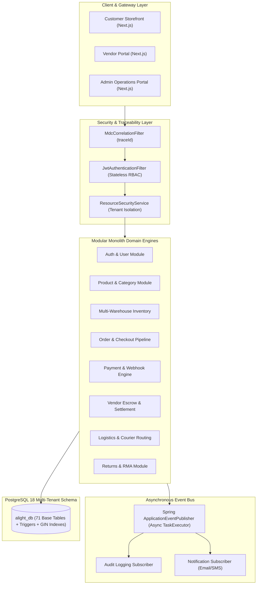
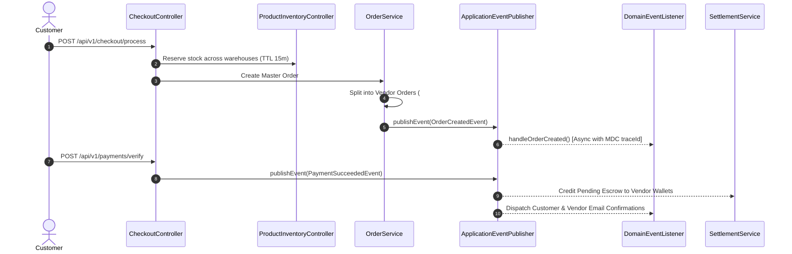

# Stage 5: Production Modular Monolith Architecture Specification
**Alight International Multi-Vendor Marketplace**  
*Document Version:* 5.0.0 (Production-Ready)  
*Runtime Platform:* Java 25 LTS | Spring Boot 3.3.4 | Spring Data JPA | Spring Security 6
*Architecture Pattern:* Modular Monolith with Asynchronous In-Memory Domain Event Bus  

---

## 1. Architectural Principles & Encapsulation Rules

1. **Strict Module Boundary Isolation**: Each domain module resides in `com.alight.marketplace.modules.<module_name>` containing its own private controllers, entities, repositories, and services.
2. **Loosely-Coupled Inter-Module Communication**:
   - **Synchronous Direct Calls**: Used strictly for read operations or immediate transaction composition via public Service interfaces (e.g. `RbacService`, `UserService`, `ResourceSecurityService`).
   - **Asynchronous Domain Events**: Used for cross-module side-effects (e.g. notifying vendors on order creation, creating audit logs, sending push/email notifications, unlocking escrow) published via Spring's `ApplicationEventPublisher`.
3. **MDC Correlation Propagation**: All background `@Async` threads automatically receive the caller's request `traceId` via `MdcTaskDecorator` to ensure end-to-end distributed tracing across async operations.
4. **Deterministic Concurrency Control**: Entity modifications on mutable transactional state use JPA `@Version` optimistic locking, handled globally with `409 Conflict` (`OPTIMISTIC_LOCK_CONFLICT`).

---

## 2. 28-Module Architecture Catalog

| Module | Package Root | Primary Domain Responsibility | Key Events Published / Consumed |
| :--- | :--- | :--- | :--- |
| **`auth`** | `modules.auth` | JWT issuance, refresh token rotation, authentication entry points | Consumes: Login events |
| **`user`** | `modules.user` | User profiles, shipping addresses, RBAC roles & permissions | Consumes: User creation |
| **`vendor`** | `modules.vendor` | Store profiles, KYC validation, bank accounts, pickup addresses | Publishes: `VendorStatusChangedEvent` |
| **`product`** | `modules.product` | Hardware catalog, variants, attributes, images, approval state | Consumes: Stock changes |
| **`category`** | `modules.category` | Hierarchical category taxonomy, brand definitions | - |
| **`inventory`** | `modules.inventory`| Multi-warehouse stock, temporary reservations (15m TTL), logs | Publishes: `StockReservedEvent` |
| **`cart`** | `modules.cart` | Multi-vendor user & guest carts, currency line items | - |
| **`order`** | `modules.order` | Master order splitting (`#10001` -> `#10001-A`, `#10001-B`), fulfillment | Publishes: `OrderCreatedEvent`, `OrderStatusUpdatedEvent` |
| **`checkout`** | `modules.checkout` | Multi-step checkout pipeline, address validation, tax calculation | Publishes: Checkout triggers |
| **`payment`** | `modules.payment` | Gateway integrations (Razorpay/Stripe), webhook idempotency | Publishes: `PaymentSucceededEvent` |
| **`settlement`** | `modules.settlement` | Vendor wallets, escrow hold periods (7d), payouts, commission invoices | Consumes: `PaymentSucceededEvent`, `OrderStatusUpdatedEvent` |
| **`logistics`** | `modules.logistics` | Carrier abstraction (Delhivery, BlueDart), rate matrix, manifests | Consumes: `OrderStatusUpdatedEvent` |
| **`returns`** | `modules.returns` | 7-day RMA claims, photo proof upload, vendor action, reverse logistics | Publishes: `RmaSubmittedEvent` |
| **`coupon`** | `modules.coupon` | Global & vendor discount coupons, redemption limits, scopes | - |
| **`pricing`** | `modules.pricing` | B2B bulk tier pricing matrix, flash sale quotas | - |
| **`currency`** | `modules.currency` | Multi-currency FX exchange rates (INR, USD, AED, EUR) | - |
| **`tax`** | `modules.tax` | GST HSN classifications (18% Hardware, 12% Brass), IGST/CGST/SGST | - |
| **`review`** | `modules.review` | Verified customer reviews, rating calculations, helpful votes | - |
| **`support`** | `modules.support` | Threaded customer & vendor support tickets, dispute escalations | - |
| **`notification`**| `modules.notification`| Email, SMS, and in-app notification template dispatches | Consumes: All domain events |
| **`search`** | `modules.search` | PostgreSQL Trigram GIN faceted search & instant autocomplete | - |
| **`bundle`** | `modules.bundle` | Curated hardware sets (e.g. "Full Modular Kitchen Package") | - |
| **`quote`** | `modules.quote` | B2B Request For Quote (RFQ) Bill of Quantities engine | - |
| **`wishlist`** | `modules.wishlist` | Saved architectural moodboards and wishlist collections | - |
| **`personalization`**| `modules.personalization`| Recently viewed items, recommendations | - |
| **`analytics`** | `modules.analytics`| Vendor dashboards, platform executive metrics, GMV reports | - |
| **`audit`** | `modules.audit` | Immutable operational audit logs | Consumes: All security & admin events |
| **`health`** | `modules.health` | Live PostgreSQL and memory diagnostic health check | - |

---

## 3. High-Level Modular Monolith Diagram (Mermaid)



---

## 4. Multi-Vendor Order & Event Lifecycle



---

## 5. Asynchronous Worker Pool Specifications (`AsyncConfig`)

```java
@Configuration
@EnableAsync
@EnableScheduling
public class AsyncConfig {
    // Core Pool: 5 worker threads
    // Max Pool: 25 worker threads
    // Queue: 100 queued events
    // Decorator: MdcTaskDecorator (preserves traceId context)
}
```
